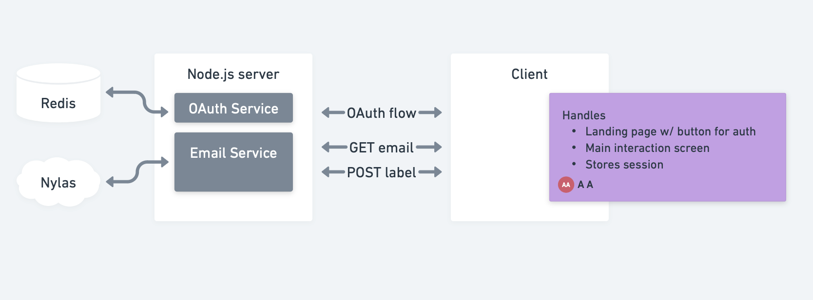

# Flickmail

Flick your messages off.

This readme covers both the server and client repos for Flickmail.

## System Overview

### Architecture



#### Backend stack

Frameworks:

- Node.js
- Express

Services:

- Nylas (email connector)
- Redis (session store)

#### Frontend stack

TBD

### User flow

TBD

### Client UI

TBD

## Server setup

### Prerequisites

- [Node.js](https://nodejs.org/en/download/) v20+
- [npm](https://www.npmjs.com/get-npm) v10+

### Setup steps

1. Clone the server repo

2. Set up server

Install server dependencies:

```bash
cd <SERVER_DIR>
npm install
```

Write the following environment variables to a `.env` file at the top level of the repo:

```bash
# .env
NYLAS_CLIENT_ID=
NYLAS_API_KEY=
NYLAS_API_URI=https://api.us.nylas.com
SESSION_SECRET=

CLIENT_URL_DEV=http://localhost:3001
SERVER_URL_DEV=http://localhost:3000

NODE_ENV=development

REDIS_HOST=
REDIS_PASSWORD=
REDIS_PORT=
```

Start the server:

```bash
npm start
# Serves on localhost:3000
# Only allows requests from localhost:3001
```

## Client setup

TBD
